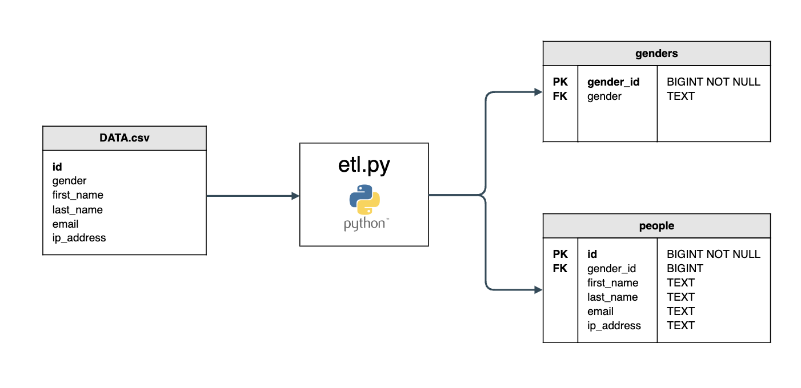

# sfl-etl
## Description
Python and Postgres ETL implementation running on docker containers to deliver the following result:


## Starting the Job

Run job and stop containers once it is finished:
```
docker-compose up --abort-on-container-exit
```

Run the job and leave the database container running:

```
docker-compose up
```

## View the data within the Postgres container

Find Image id using ```docker ps``` and copy it.

Enter container
```
docker exec -it <container_id> /bin/sh
```

Start psql client
```
psql -d database -U username
```

View tables
```
\dt
```

## Stopping the Containers

```
docker-compose down
```
```
CTRL + C
```
